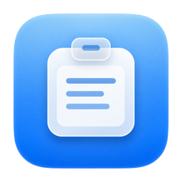
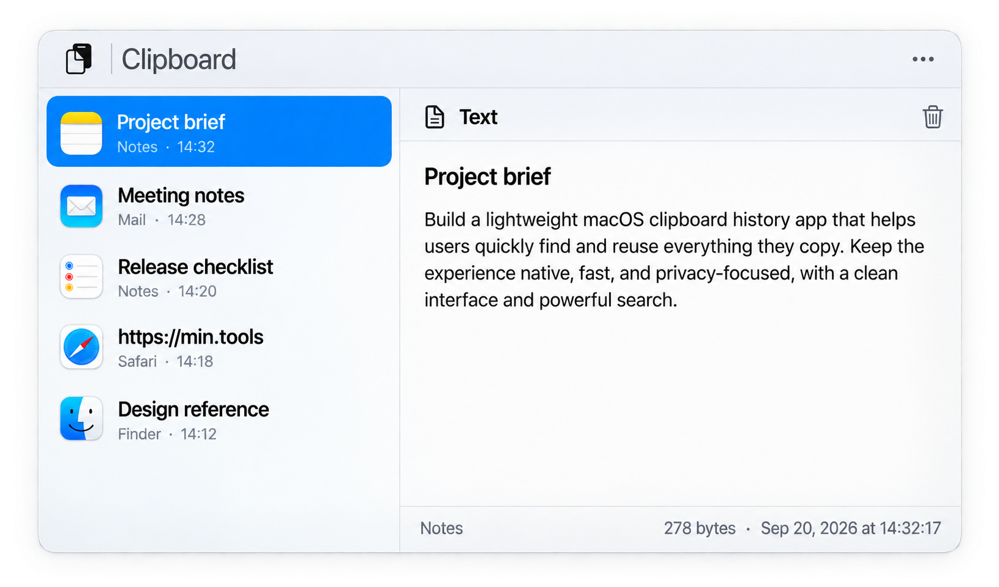

  

<h1 align="center">Pastemin</h1>

<strong>Your clipboard, ready when you need it.</strong>

  Keep a searchable history of the text and images you copy on your Mac. Open it from anywhere, preview an item, and put it back on the clipboard in a few keystrokes. Private by design.

  <a href="https://min.tools/pastemin">Website</a>&nbsp;&nbsp;|&nbsp;&nbsp;
  <a href="https://min.tools/pastemin/support/">Support</a>&nbsp;&nbsp;|&nbsp;&nbsp;
  <a href="PRIVACY.md">Privacy</a>&nbsp;&nbsp;|&nbsp;&nbsp;
  <a href="docs/distribution.md">Build</a>

  
  
  
  
  
  
  

  <picture>
    <source media="(prefers-color-scheme: dark)" srcset="docs/images/hero-dark.png">
    
  </picture>

- **Find an earlier copy in seconds**  
  Press **⌃⌥C**, start typing, and search the complete text of your clipboard history.
- **Text and images together**  
  Preview copied text at full length and inspect images without opening another app.
- **Made for the keyboard**  
  Move with the arrow keys, press Return to restore an item, delete one with **⌘Delete**, and dismiss with Escape.
- **Optional automatic paste**  
  Pastemin can send one **⌘V** after you choose an item. It is off by default and works only after you enable it and grant macOS permission.
- **Your history stays on this Mac**  
  Clipboard content lives inside Pastemin's sandbox. There is no Pastemin account, analytics, advertising, or developer server.
- **You decide what remains**  
  Keep copied items for an hour, a day, a week, a month, three months, or forever. Clear one item, the current clipboard, or the whole history whenever you want.
- **Sensitive items are respected**  
  Pastemin ignores clipboard entries that apps mark as concealed, temporary, or automatically generated.
- **At home on macOS**  
  Use the menu bar, choose your own global shortcut, and work in any of thirty-one interface languages.

## Get started

1. Open Pastemin and finish the short setup.
2. Copy text or an image in any app.
3. Press **⌃⌥C**, find the item, and press Return.

Pastemin restores the selected item to the clipboard and returns you to the app you were using. When automatic paste is enabled and allowed, it also pastes the item for you.

> [!NOTE]
> Pastemin needs an Apple-silicon Mac running macOS 14 or later. Automatic paste is optional; normal copy and paste works without Accessibility permission.

## Find and restore

The search field is ready as soon as Pastemin opens. Results update while you type, including text stored outside the compact history index. The newest copies appear first, and choosing an older item moves it back to the top.

| Action | Key |
| --- | --- |
| Open Pastemin | **⌃⌥C** by default |
| Search | Start typing |
| Move through results | **↑** and **↓** |
| Restore the selected item | **Return** |
| Delete the selected item | **⌘Delete** |
| Close Pastemin | **Escape** |
| Open options | **⌘,** |

Large text and image payloads load only when needed, so a long history does not have to enter memory at launch. The list renders in batches as you scroll.

## Your clipboard, your rules

Choose how long copied items remain, whether Pastemin appears in the menu bar, and which shortcut opens it. The storage summary shows how much space the history uses, and **Show in Finder** opens its local folder.

Automatic paste stays off until you turn it on. Pastemin requests macOS event-posting access only when you first select an item with the option enabled. If access is unavailable or declined, the item is still copied and focus returns to the previous app.

## Private by design

Pastemin stores clipboard history only in its sandboxed Application Support folder. Clipboard content never leaves the Mac. StoreKit communicates with Apple only for product and purchase information.

Apps can mark password-manager output and other short-lived data as concealed, transient, or automatically generated. Pastemin does not archive those items. You can inspect the full policy in [Privacy](PRIVACY.md).

## One app, two ways to use it

**Mac App Store:** The free download starts with 30 days of full history access. No subscription starts, and there is no charge. After the trial, Pastemin keeps monitoring the clipboard while the window shows and searches the five newest items. A yearly subscription or lifetime purchase restores the complete history.

**Build from source:** The public build starts the same 30-day trial locally after its disclosure; the Mac App Store build uses Apple's signed original acquisition date. Both use the same five-item limit and purchase rules.

## Build

This source-available repository contains the public app source. Public builds use the same 30-day duration, five-item limit, StoreKit checks, and post-trial banner as the App Store app. See [Build and distribution](docs/distribution.md).

If Pastemin helps you, [contribute](CONTRIBUTING.md) to its development.

## Documentation

| Guide | What it covers |
| --- | --- |
| [Build and distribution](docs/distribution.md) | Build requirements, public editions, signing, and tests |
| [Privacy](PRIVACY.md) | Local storage, ignored clipboard types, purchases, and your controls |

## License

Copyright 2026 [Ilia Ross](https://github.com/iliaross). The source is available under the [PolyForm Strict License 1.0.0 with added permissions for personal modification and contributions](LICENSE). You may inspect, build, and run it for noncommercial purposes, modify it for your own personal, noncommercial use, and prepare a contribution to the official repository under the [contribution terms](CONTRIBUTING.md). The repository license does not otherwise permit distributing the source, modified copies, or binaries. The Min Tools name, the Pastemin name, and the Pastemin icon are not licensed. The Mac App Store build follows Apple's [standard EULA](https://www.apple.com/legal/internet-services/itunes/dev/stdeula/).
